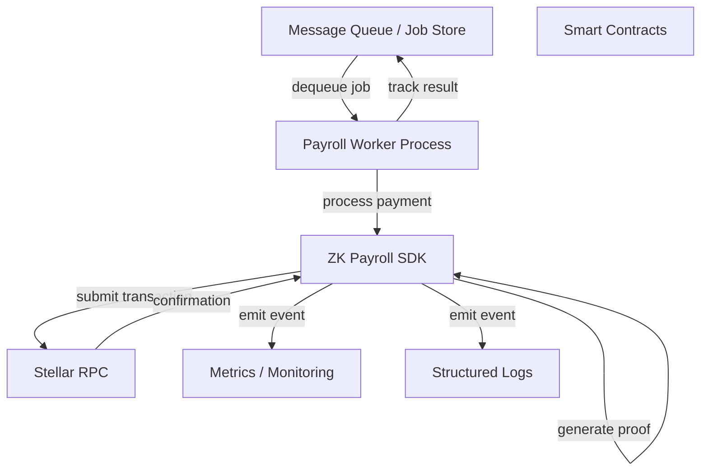

# Backend Integration Guide for Payroll Automation Services

This guide covers best practices for embedding the ZK Payroll SDK into backend services and automation systems. It complements the [Backend Worker Quickstart](./BACKEND_WORKER_QUICKSTART.md) with operational guidance for production deployments.

## Table of Contents

1. [Service Architecture](#service-architecture)
2. [Configuration Management](#configuration-management)
3. [Secret Handling](#secret-handling)
4. [Event Handling and Observability](#event-handling-and-observability)
5. [Error Handling and Retries](#error-handling-and-retries)
6. [Operational Best Practices](#operational-best-practices)
7. [Example Architecture](#example-architecture)

---

## Service Architecture

### Backend Service Pattern

The backend service pattern is suitable for payroll automation services where:

- An employer or payroll provider manages signer keys.
- Multiple employees or payment recipients are processed through a central orchestrator.
- Proof generation is offloaded from user browsers to stable server infrastructure.



### Deployment Options

#### Option 1: Long-Running Worker Process

A single process polls a job queue continuously:

```typescript
// src/worker.ts
import { PayrollService } from '@zk-payroll/sdk';

async function runWorkerLoop() {
  while (true) {
    const jobs = await fetchPendingJobs();
    for (const job of jobs) {
      await processJobWithRetry(job);
    }
    await sleep(5000); // Poll interval
  }
}

runWorkerLoop().catch((err) => {
  console.error('Worker failed', err);
  process.exit(1);
});
```

**Pros:** Simple to reason about, straightforward state tracking.
**Cons:** Single point of failure; requires graceful shutdown handling.

#### Option 2: Serverless / Event-Driven

Deploy proof generation as a serverless function triggered by events:

```typescript
// Example: AWS Lambda handler
import { PayrollService } from '@zk-payroll/sdk';

export const handler = async (event: SQSEvent) => {
  for (const record of event.Records) {
    const job = JSON.parse(record.body);
    await processJob(job);
  }
};
```

**Pros:** Scales automatically; pay per invocation.
**Cons:** Cold start latency; complex state management; proof generation is CPU-intensive.

#### Option 3: Hybrid (Recommended)

Long-running worker for primary load; serverless for overflow or burst:

```typescript
// Worker dequeues jobs; if queue depth > threshold, trigger Lambda
if (queueDepth > 1000) {
  await triggerServerlessFunction(batchOfJobs);
}
```

---

## Configuration Management

### Environment Variables

Structure configuration hierarchically to support multiple environments (dev, staging, prod):

```bash
# .env.production
NODE_ENV=production
LOG_LEVEL=info

# Network Configuration
NETWORK=testnet
RPC_URL=https://testnet.sorobanrpc.com
CONTRACT_ID=CDSXX...

# Proof Generation (store URLs in CDN or artifact server)
WASM_URL=https://artifacts.example.com/circuits/payment.wasm
ZKEY_URL=https://artifacts.example.com/circuits/payment.zkey

# Signing
SIGNER_SECRET=S...  # Encrypted in secrets manager, not in version control

# Operational
WORKER_POOL_SIZE=4
QUEUE_POLL_INTERVAL_MS=5000
MAX_RETRY_ATTEMPTS=3
RETRY_BACKOFF_MS=1000
```

### Configuration Object

Load and validate environment at startup:

```typescript
interface WorkerConfig {
  network: 'testnet' | 'mainnet';
  rpcUrl: string;
  contractId: string;
  wasmUrl: string;
  zkeyUrl: string;
  signerSecret: string;
  workerPoolSize: number;
  queuePollIntervalMs: number;
  maxRetryAttempts: number;
  retryBackoffMs: number;
}

function loadConfig(): WorkerConfig {
  const config: WorkerConfig = {
    network: (process.env.NETWORK as 'testnet' | 'mainnet') || 'testnet',
    rpcUrl: process.env.RPC_URL || 'https://testnet.sorobanrpc.com',
    contractId: process.env.CONTRACT_ID || '',
    wasmUrl: process.env.WASM_URL || '',
    zkeyUrl: process.env.ZKEY_URL || '',
    signerSecret: process.env.SIGNER_SECRET || '',
    workerPoolSize: parseInt(process.env.WORKER_POOL_SIZE || '4', 10),
    queuePollIntervalMs: parseInt(process.env.QUEUE_POLL_INTERVAL_MS || '5000', 10),
    maxRetryAttempts: parseInt(process.env.MAX_RETRY_ATTEMPTS || '3', 10),
    retryBackoffMs: parseInt(process.env.RETRY_BACKOFF_MS || '1000', 10),
  };

  // Validation
  if (!config.contractId) throw new Error('CONTRACT_ID is required');
  if (!config.signerSecret) throw new Error('SIGNER_SECRET is required');
  if (!config.wasmUrl) throw new Error('WASM_URL is required');
  if (!config.zkeyUrl) throw new Error('ZKEY_URL is required');

  return config;
}

export const config = loadConfig();
```

---

## Secret Handling

### Best Practices

**Never** commit secrets to version control, even in `.env` files. Use a secrets manager in production.

#### Development Environment

Use a `.env.local` file (add to `.gitignore`):

```bash
# .env.local (gitignored)
SIGNER_SECRET=S123abc...
```

Load with `dotenv`:

```typescript
import dotenv from 'dotenv';
dotenv.config({ path: '.env.local' });

const secret = process.env.SIGNER_SECRET;
```

#### Staging / Production Environment

Use a secrets manager (AWS Secrets Manager, HashiCorp Vault, etc.):

```typescript
import { SecretsManagerClient, GetSecretValueCommand } from '@aws-sdk/client-secrets-manager';

async function loadSignerSecret(): Promise<string> {
  const client = new SecretsManagerClient({ region: 'us-east-1' });
  const result = await client.send(
    new GetSecretValueCommand({ SecretId: 'payroll-signer-secret' })
  );
  return result.SecretString || '';
}

const signerSecret = await loadSignerSecret();
```

### Secret Rotation

Plan for secret rotation without downtime:

1. Secrets manager automatically rotates the signing key.
2. Worker reads the latest secret on every job (or cache with TTL).
3. Stellar network transactions include the signer's public key; rotation does not require contract updates.

```typescript
// Cache secret with a 1-hour TTL
interface CachedSecret {
  value: string;
  loadedAt: number;
}

let cachedSecret: CachedSecret | null = null;

async function getSignerSecret(): Promise<string> {
  const now = Date.now();
  const ttlMs = 3600 * 1000; // 1 hour

  if (cachedSecret && now - cachedSecret.loadedAt < ttlMs) {
    return cachedSecret.value;
  }

  const secret = await loadSignerSecret();
  cachedSecret = { value: secret, loadedAt: now };
  return secret;
}
```

### Secure Defaults

- Use HTTPS-only for artifact URLs (wasm, zkey).
- Store secrets in environment variables or a secrets manager, never in source code.
- Rotate signer keys periodically (e.g., quarterly).
- Log and audit all secret access attempts.

---

## Event Handling and Observability

### SDK Event Emitters

The SDK emits lifecycle events through a logger interface. Capture and forward those events to your monitoring system:

```typescript
import { createHookLogger, PayrollService } from '@zk-payroll/sdk';

const logger = createHookLogger((entry) => {
  // Entry has: event, level, context, timestamp

  // Emit to your observability stack
  if (entry.level === 'error') {
    Sentry.captureException(entry.context?.error);
  }

  if (entry.event === 'payment_complete') {
    metrics.increment('payroll.payments.completed', {
      recipient: entry.context?.recipient,
    });
  }

  // Forward to structured logging
  console.log(JSON.stringify({
    timestamp: new Date().toISOString(),
    level: entry.level,
    event: entry.event,
    context: entry.context,
  }));
});

const payrollService = new PayrollService(
  contractWrapper,
  proofGenerator,
  signer,
  network,
  logger
);
```

### Key Events to Monitor

| Event | Level | Meaning | Action |
|-------|-------|---------|--------|
| `payment_start` | info | Payment processing began | Track latency |
| `proof_generation_start` | info | ZK proof generation started | Track proof time |
| `proof_generation_complete` | info | Proof generated successfully | Record proof size, time |
| `contract_invocation_start` | info | Submitting transaction to contract | Track network latency |
| `payment_complete` | info | Payment confirmed on-chain | Increment success counter |
| `payment_validation_failed` | error | Input validation failed | Increment error counter; do NOT retry |
| `proof_generation_failed` | error | Proof generation failed | Increment error counter; may retry |
| `contract_invocation_failed` | error | Transaction failed on-chain | Inspect error type (transient vs. permanent) |

### Structured Logging

Log events in a format that is searchable (JSON):

```typescript
const logger = createHookLogger((entry) => {
  const logLine = {
    timestamp: new Date().toISOString(),
    level: entry.level,
    event: entry.event,
    jobId: entry.context?.jobId,
    recipient: entry.context?.recipient,
    duration: entry.context?.durationMs,
    error: entry.context?.error?.message,
    errorCode: entry.context?.error?.code,
    txHash: entry.context?.txHash,
  };

  console.log(JSON.stringify(logLine));
});
```

### Alerting

Set up alerts for critical events:

```typescript
const logger = createHookLogger((entry) => {
  if (entry.event === 'proof_generation_failed') {
    sendAlert({
      severity: 'critical',
      message: `Proof generation failed: ${entry.context?.error?.message}`,
      jobId: entry.context?.jobId,
    });
  }

  if (entry.event === 'contract_invocation_failed' &&
      !isTransientError(entry.context?.error)) {
    sendAlert({
      severity: 'high',
      message: `Permanent contract failure: ${entry.context?.error?.message}`,
      txHash: entry.context?.txHash,
    });
  }
});
```

---

## Error Handling and Retries

### Transient vs. Permanent Errors

Classify errors to determine retry strategy:

```typescript
function isTransientError(error: unknown): boolean {
  const msg = error instanceof Error ? error.message : String(error);

  // Network and RPC timeouts
  if (/timeout|network|econnrefused|enotfound/i.test(msg)) {
    return true;
  }

  // Temporary Soroban RPC issues
  if (/server error|temporarily unavailable/i.test(msg)) {
    return true;
  }

  return false;
}

function isPermanentError(error: unknown): boolean {
  const msg = error instanceof Error ? error.message : String(error);

  // Validation failures
  if (/invalid recipient|invalid amount|invalid asset/i.test(msg)) {
    return true;
  }

  // Proof generation failures (unless circuit is misconfigured)
  if (/proof generation failed/i.test(msg) && !/circuit/i.test(msg)) {
    return true;
  }

  return false;
}
```

### Retry Strategy

Use exponential backoff with jitter to avoid thundering herd:

```typescript
async function processJobWithRetry(
  job: PayrollJob,
  maxAttempts = 3,
  baseBackoffMs = 1000
): Promise<void> {
  for (let attempt = 1; attempt <= maxAttempts; attempt += 1) {
    try {
      const result = await payrollService.processPayment({
        recipient: job.recipient,
        amount: job.amount,
        asset: job.asset,
      });

      console.log(`Job ${job.id} succeeded on attempt ${attempt}`, {
        txHash: result.txHash,
      });
      return;
    } catch (error) {
      const isTransient = isTransientError(error);
      const shouldRetry = attempt < maxAttempts && isTransient;

      if (!shouldRetry) {
        console.error(`Job ${job.id} failed permanently`, {
          attempt,
          error: error instanceof Error ? error.message : String(error),
          errorCode: error instanceof Error ? error.code : undefined,
        });
        throw error; // Caller decides what to do with permanent failures
      }

      // Exponential backoff: 1s, 2s, 4s, ... + random jitter
      const backoffMs = baseBackoffMs * Math.pow(2, attempt - 1);
      const jitterMs = Math.random() * 1000;
      const totalBackoffMs = backoffMs + jitterMs;

      console.warn(`Job ${job.id} failed on attempt ${attempt}; retrying in ${totalBackoffMs}ms`, {
        error: error instanceof Error ? error.message : String(error),
      });

      await new Promise((resolve) => setTimeout(resolve, totalBackoffMs));
    }
  }
}
```

### Handling Permanent Failures

Store permanent failures in a dead-letter queue for manual review:

```typescript
interface DeadLetterEntry {
  jobId: string;
  job: PayrollJob;
  error: string;
  errorCode?: string;
  timestamp: string;
}

async function processJobWithDeadLetter(job: PayrollJob): Promise<void> {
  try {
    await processJobWithRetry(job);
  } catch (error) {
    if (isPermanentError(error)) {
      const entry: DeadLetterEntry = {
        jobId: job.id,
        job,
        error: error instanceof Error ? error.message : String(error),
        errorCode: error instanceof Error ? (error as any).code : undefined,
        timestamp: new Date().toISOString(),
      };

      // Store in dead-letter queue / database for investigation
      await saveDeadLetterEntry(entry);
      console.error(`Dead-letter entry created for job ${job.id}`, entry);
    } else {
      // Re-throw transient errors so the job can be retried later
      throw error;
    }
  }
}
```

---

## Operational Best Practices

### Health Checks

Implement a health check endpoint to verify the worker is functioning:

```typescript
import { PayrollService } from '@zk-payroll/sdk';

interface HealthStatus {
  status: 'healthy' | 'unhealthy';
  checks: {
    rpcConnection: 'ok' | 'failed';
    contractReachable: 'ok' | 'failed';
    circuitArtifacts: 'ok' | 'failed';
    lastJobProcessedAt: string | null;
  };
}

async function checkHealth(): Promise<HealthStatus> {
  const checks = {
    rpcConnection: 'ok' as 'ok' | 'failed',
    contractReachable: 'ok' as 'ok' | 'failed',
    circuitArtifacts: 'ok' as 'ok' | 'failed',
  };

  // Test RPC connection
  try {
    await server.getLatestLedger();
  } catch (error) {
    checks.rpcConnection = 'failed';
  }

  // Test contract reachability
  try {
    await contractWrapper.getContractMetadata();
  } catch (error) {
    checks.contractReachable = 'failed';
  }

  // Test circuit artifacts
  try {
    await fetch(config.wasmUrl, { method: 'HEAD' });
    await fetch(config.zkeyUrl, { method: 'HEAD' });
  } catch (error) {
    checks.circuitArtifacts = 'failed';
  }

  const status = Object.values(checks).every((c) => c === 'ok') ? 'healthy' : 'unhealthy';

  return {
    status,
    checks: {
      ...checks,
      lastJobProcessedAt: getLastJobProcessedTime(),
    },
  };
}
```

### Graceful Shutdown

Handle shutdown signals to ensure in-flight jobs complete:

```typescript
let isShuttingDown = false;
let activeJobs = 0;

async function gracefulShutdown() {
  console.log('Shutdown signal received; waiting for active jobs...');
  isShuttingDown = true;

  // Wait up to 60 seconds for active jobs to complete
  for (let i = 0; i < 60; i += 1) {
    if (activeJobs === 0) {
      console.log('All jobs completed; exiting');
      process.exit(0);
    }
    await new Promise((resolve) => setTimeout(resolve, 1000));
  }

  console.error('Timeout waiting for jobs; forcing exit');
  process.exit(1);
}

process.on('SIGTERM', gracefulShutdown);
process.on('SIGINT', gracefulShutdown);

async function processJobWithTracking(job: PayrollJob): Promise<void> {
  activeJobs += 1;
  try {
    await processJobWithDeadLetter(job);
  } finally {
    activeJobs -= 1;
  }
}

async function runWorkerLoop() {
  while (!isShuttingDown) {
    const jobs = await fetchPendingJobs();
    for (const job of jobs) {
      if (isShuttingDown) break; // Stop accepting new jobs during shutdown
      await processJobWithTracking(job);
    }
    await sleep(config.queuePollIntervalMs);
  }
}
```

### Monitoring and Metrics

Track key performance indicators:

```typescript
interface Metrics {
  jobsProcessed: number;
  jobsFailed: number;
  jobsRetried: number;
  proofGenerationTimeMs: number[];
  transactionConfirmationTimeMs: number[];
  queueDepth: number;
  lastHeartbeatAt: Date;
}

const metrics: Metrics = {
  jobsProcessed: 0,
  jobsFailed: 0,
  jobsRetried: 0,
  proofGenerationTimeMs: [],
  transactionConfirmationTimeMs: [],
  queueDepth: 0,
  lastHeartbeatAt: new Date(),
};

// Emit metrics every 60 seconds
setInterval(() => {
  console.log('Metrics snapshot', {
    jobsProcessed: metrics.jobsProcessed,
    jobsFailed: metrics.jobsFailed,
    jobsRetried: metrics.jobsRetried,
    avgProofTimeMs: metrics.proofGenerationTimeMs.length > 0
      ? metrics.proofGenerationTimeMs.reduce((a, b) => a + b, 0) / metrics.proofGenerationTimeMs.length
      : 0,
    avgConfirmationTimeMs: metrics.transactionConfirmationTimeMs.length > 0
      ? metrics.transactionConfirmationTimeMs.reduce((a, b) => a + b, 0) / metrics.transactionConfirmationTimeMs.length
      : 0,
    queueDepth: metrics.queueDepth,
  });
}, 60000);
```

---

## Example Architecture

### Full Worker Implementation

```typescript
import { Keypair, Networks, rpc } from '@stellar/stellar-sdk';
import {
  createHookLogger,
  DEFAULT_CONFIG,
  PayrollContractWrapper,
  PayrollService,
  SnarkjsProofGenerator,
  validateEnvironment,
} from '@zk-payroll/sdk';

// ===== Configuration =====
interface WorkerConfig {
  rpcUrl: string;
  contractId: string;
  wasmUrl: string;
  zkeyUrl: string;
  signerSecret: string;
  queuePollIntervalMs: number;
  maxRetryAttempts: number;
}

function loadConfig(): WorkerConfig {
  return {
    rpcUrl: process.env.RPC_URL || DEFAULT_CONFIG.networkUrl,
    contractId: process.env.CONTRACT_ID || DEFAULT_CONFIG.contractId,
    wasmUrl: process.env.WASM_URL || '',
    zkeyUrl: process.env.ZKEY_URL || '',
    signerSecret: process.env.SIGNER_SECRET || '',
    queuePollIntervalMs: parseInt(process.env.QUEUE_POLL_INTERVAL_MS || '5000', 10),
    maxRetryAttempts: parseInt(process.env.MAX_RETRY_ATTEMPTS || '3', 10),
  };
}

const config = loadConfig();

// ===== Logger Setup =====
const logger = createHookLogger((entry) => {
  console.log(JSON.stringify({
    timestamp: new Date().toISOString(),
    level: entry.level,
    event: entry.event,
    context: entry.context,
  }));
});

// ===== SDK Initialization =====
const server = new rpc.Server(config.rpcUrl);
const contractWrapper = new PayrollContractWrapper(server, config.contractId);
const proofGenerator = new SnarkjsProofGenerator({
  wasmUrl: config.wasmUrl,
  zkeyUrl: config.zkeyUrl,
});
const signer = Keypair.fromSecret(config.signerSecret);

const payrollService = new PayrollService(
  contractWrapper,
  proofGenerator,
  signer,
  Networks.TESTNET,
  logger
);

// ===== Job Processing =====
interface PayrollJob {
  id: string;
  recipient: string;
  amount: bigint;
  asset: string;
}

async function processJob(job: PayrollJob): Promise<void> {
  for (let attempt = 1; attempt <= config.maxRetryAttempts; attempt += 1) {
    try {
      const result = await payrollService.processPayment({
        recipient: job.recipient,
        amount: job.amount,
        asset: job.asset,
      });

      console.log(`Job ${job.id} succeeded`, { txHash: result.txHash });
      return;
    } catch (error) {
      const isTransient = /timeout|network|rpc|temporar/i.test(
        error instanceof Error ? error.message : String(error)
      );

      if (attempt === config.maxRetryAttempts || !isTransient) {
        console.error(`Job ${job.id} failed permanently`, {
          error: error instanceof Error ? error.message : String(error),
        });
        return;
      }

      const backoffMs = Math.pow(2, attempt - 1) * 1000;
      console.warn(`Job ${job.id} retry in ${backoffMs}ms`);
      await new Promise((resolve) => setTimeout(resolve, backoffMs));
    }
  }
}

// ===== Main Loop =====
async function main() {
  // Validate environment
  const sanity = await validateEnvironment(
    { networkUrl: config.rpcUrl, contractId: config.contractId },
    { wasmUrl: config.wasmUrl, zkeyUrl: config.zkeyUrl }
  );

  if (!sanity.isValid) {
    console.error('Environment validation failed');
    for (const diag of sanity.diagnostics) {
      console.error(`[${diag.component}] ${diag.status}: ${diag.message}`);
    }
    process.exit(1);
  }

  console.log('Worker started; polling for jobs...');

  while (true) {
    try {
      const jobs = await fetchPendingJobs();
      for (const job of jobs) {
        await processJob(job);
      }
    } catch (error) {
      console.error('Worker loop error', { error });
    }

    await new Promise((resolve) => setTimeout(resolve, config.queuePollIntervalMs));
  }
}

async function fetchPendingJobs(): Promise<PayrollJob[]> {
  // Replace with your job store implementation
  return [];
}

main().catch((err) => {
  console.error('Worker failed', err);
  process.exit(1);
});
```

---

## Related Documentation

- [Backend Worker Quickstart](./BACKEND_WORKER_QUICKSTART.md) — quick-start guide
- [Integration Patterns](./INTEGRATION_PATTERNS.md) — architecture patterns
- [API Reference](./API.md) — complete SDK API
- [Testing Guide](./TESTING.md) — testing strategies
- [Troubleshooting Guide](./TROUBLESHOOTING.md) — common issues
